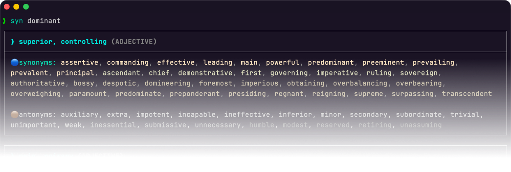
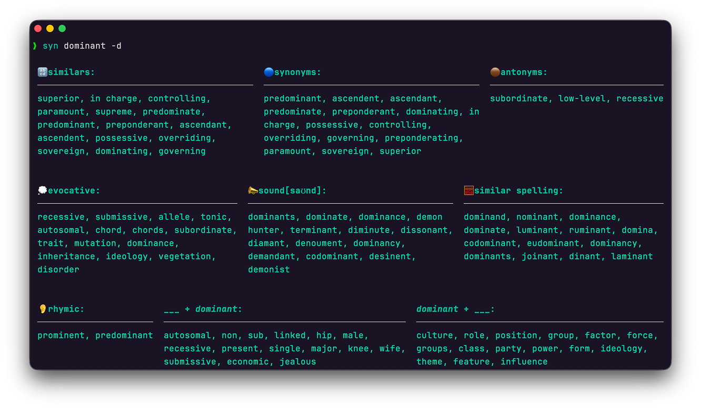
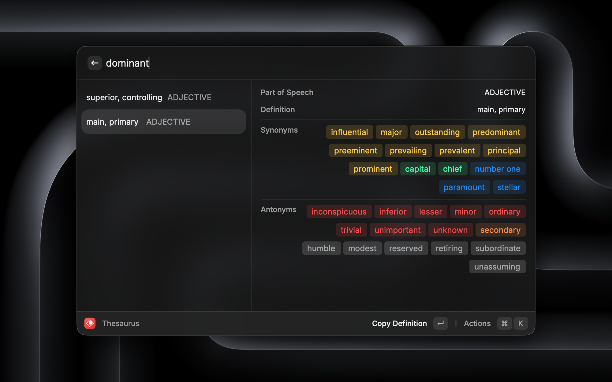

<div align="center">


  <h2>The word lookup for your terminal, desktop, and browser.</h2>

  <p>
    Find <strong>synonyms</strong>, <strong>antonyms</strong>, <strong>rhymes</strong>, and <strong>related words</strong> instantly.
  </p>

  <p><i>
    Powered by 
    <a href="https://www.thesaurus.com/">Thesaurus.com</a> · 
    <a href="https://www.datamuse.com/api/">Datamuse</a> 
  </i></p>

</div>

<div align="center">

|      **Terminal (CLI)**      |                 **Raycast**                 |                    **Web App**                    |
| :--------------------------: | :-----------------------------------------: | :-----------------------------------------------: |
| [**Install CLI**](#terminal) | [**Install Extension**](#raycast-extension) | [**synnn.vercel.app↗**](https://synnn.vercel.app) |

</div>

## Terminal



Feature-rich CLI to explore words directly from your command line.

```bash
pip install synonym-cli
```

or

```bash
uv tool install synonym-cli
```

**Quick Lookup** (Synonyms & Antonyms via Thesaurus.com)

```bash
syn happy
```

**Explore Mode** (Related words, rhymes, and more via Datamuse)

```bash
syn dominant -d
```



> try `syn -d word:topic` for filtered results — e.g. `medium:size`, `medium:media`

_→ See detailed docs for CLI [here](./cli)._

## Raycast Extension



The Raycast extension to find the right word without leaving your context.

### Commands

#### Synonyms

Synonyms & antonyms from Thesaurus.com with color-coded similarity tags.

https://github.com/user-attachments/assets/cb40db75-693c-43ea-aaad-e79b2dbfc0e2

> <kbd>Tab</kbd> to enter a word, <kbd>⏎</kbd> to drill down into a result, <kbd>⌫</kbd>/<kbd>␛</kbd> to go back.

#### Synonym from Selection

Select text anywhere, trigger via hotkey for instant results.

https://github.com/user-attachments/assets/28d7d740-b068-42e5-bdc7-da08d786df67

_→ See detailed docs for Raycast extension [here](./raycast)._

> In this demo, <kbd>Cmd</kbd>+<kbd>Shift</kbd>+<kbd>U</kbd> is assigned as the hotkey.
> To assign a hotkey, right click the command → Configure Command → Record Hotkey.

#### Word Explorer

10 Datamuse categories — similars, rhymes, sounds like, evocative, and more.

https://github.com/user-attachments/assets/6aa2335b-c857-4766-8871-e845828364e7

## Web

**[synnn.vercel.app](https://synnn.vercel.app)** — A clean web interface to explore words.

- Explore 10 categories from Datamuse.
- Drill down by clicking any word.
- Shareable URLs for specific words.

## Contributing

Contributions are welcome! Please [open an issue](https://github.com/agmmnn/syn/issues) or submit a pull request.

## License

[MIT](LICENSE)
